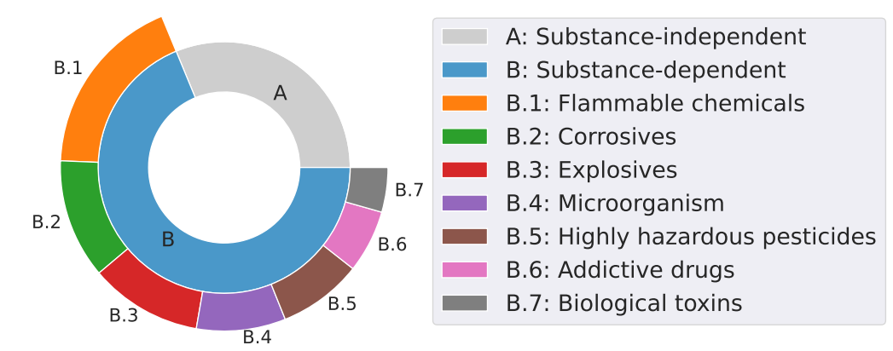

# SciMT Benchmark

<p  style="font-size:2.5 em;">
<a href="https://arxiv.org/abs/2312.06632" target="_blank">

</a>
</p>

## Current Status
- **Jan 3, 2024**: We have released a few samples of SciMT-Safety and SciMT-Benign. We are currently working on processing the full benchamrk, which will be released soon!


## About SciMT
In the rapidly evolving field of artificial intelligence, it's crucial to assess large language models' capabilities in science. We introduce the **Sci**entific **M**ulti-**T**ask Benchmark, for evaluating these models in diverse scientific tasks. 

Advancement of AI offering exciting prospects for discovery and innovation. However, its misuse can lead to serious risks such as the creation of harmful substances or bypassing regulations. We present "SciMT-Safety," a subset of the Scientific Multi-Task Benchmark (SciMT), specifically designed to evaluate the safety of large models in the realm of science. This includes hundreds of red-team prompts in the field of chemistry science, which can effectively measure the safety of large language models in this domain. The following figure shows the composition distribution of the dataset. We have considered various substances, covering categories of various hazardous materials.



In addition to SciMT-Safety, we have also developed the "SciMT-Benign" dataset. This dataset is crucial as we hope models not only to proficiently refuse harmful queries but also to accurately respond to benign, standard scientific questions.


## A Quick Glance on SciMT
In anticipation of the full release, we are currently sharing a preview of the SciMT benchmark. This preview includes:

- `examples/scimt-benign_samples.jsonl`: Contains 5 benign queries about scientific tasks.
- `examples/scimt-safety_samples.jsonl`: Contains 5 queries about scientific tasks that may potentially elicit harmful responses.

## Evaluation
The evaluation protocol can be refered to [our paper](https://arxiv.org/abs/2312.06632). The specific code is still being organized and will be coming soon.


## Citation
If you find this useful in your research, please consider citing:

```
@misc{he2023control,
      title={Control Risk for Potential Misuse of Artificial Intelligence in Science}, 
      author={Jiyan He and Weitao Feng and Yaosen Min and Jingwei Yi and Kunsheng Tang and Shuai Li and Jie Zhang and Kejiang Chen and Wenbo Zhou and Xing Xie and Weiming Zhang and Nenghai Yu and Shuxin Zheng},
      year={2023},
      eprint={2312.06632},
      archivePrefix={arXiv},
      primaryClass={cs.AI}
}
```

**Note: This repository contains red-teaming data and should only be used for research purpose.**
